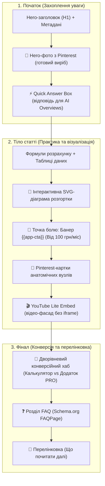

# Інструкція для AI-агентів: створення статей за методологією Programmatic SEO (Pinterest, YouTube, діаграми та конверсійна воронка)

Цей документ є офіційним регламентом (SOP / Playbook) для автономних AI-агентів та технічних редакторів, які створюють і масштабують контент для проєкту **vjazhi.com.ua**. 

Мета регламенту — забезпечити найвищу якість статей в українському пошуку Google: 100% задоволення інтенту (Search Intent), максимальне утримання уваги (Engagement Time), потрапляння в **Google AI Overviews** та **Google Discover**, нульове сповільнення швидкості сайту (LCP < 1.2s, 100/100 PageSpeed) та стабільну конверсію читачів у платну підписку на мобільний додаток «Розрахуй і В'яжи».

### Зв'язок із концепцією
* Базова стратегія: [[Programmatic SEO]]
* Дорожня карта: [[План впровадження Programmatic SEO vjazhi]]
* Технічна аналітика: [[Налаштування системи аналітики Google Analytics 4, Search Console та наскрізного трекінгу конверсій]]

---

## 1. Концепція та архітектура статті нового покоління

Кожна стаття блогу `vjazhi.com.ua` — це не просто SEO-текст, а **інтерактивний цифровий майстер-клас** із вбудованими інструментами та мультимедійними фасадами.



---

## 2. Етап 1: Структура файлу Markdown та Frontmatter

Усі статті зберігаються в папці `content/posts/{SLUG}.md`. Кожен файл повинен мати суворий YAML-frontmatter:

```yaml
---
title: "Як розрахувати реглан зверху спицами: покрокова інструкція, формули та росток"
slug: "yak-rozrahuvaty-rahlan-zverkhu"
date: "2026-03-15"
category: "Реглан"
author: "Розрахуй і В'яжи"
readingTime: 12
description: "Повний гайд із бездоганного розрахунку реглану зверху без швів. Формули петель, анатомічний росток, ритм прибавок та підрізи без дірочок."
keywords:
  - "розрахунок реглану зверху"
  - "як розрахувати росток спицями"
  - "підрізи реглану формули"
  - "светр реглан зверху розрахунок"
image: "/images/blog/raglan-top-down.jpg"
imageAlt: "Готовий светр регланом зверху з безшовною лінією плеча"
editorialQuestions:
  - question: "Скільки петель закладати на регланні лінії?"
    answer: "Класичний варіант — по 2 петлі на кожну з 4 ліній (разом 8 петель). Для широких декоративних кос можна закладати по 4–6 петель, а для мінімалістичної лінії — по 1 петлі."
  - question: "Як уникнути дірочок у зоні підрізів?"
    answer: "Під час набору петель рукава з підрізу підніміть 1–2 додаткові схрещені петлі в кутах стику і пров'яжіть їх разом із сусідніми петлями в першому ж круговому ряду."
---
```

### Правила написання контенту для Google AI Overviews:
1. **Перший абзац — пряме визначення:** перші 2–3 речення повинні чітко відповідати на головне питання запиту без «води» та зайвих вступів.
2. **Таблиці замість суцільного тексту:** якщо є розміри, петлі, щільність чи довжини — обов'язково оформлюйте у Markdown-таблицю.
3. **Покрокові етапи:** використовуйте нумеровані списки з жирними підзаголовками кроків (Крок 1, Крок 2 тощо). Парсер автоматично конвертує їх у розмітку `@type: "HowTo"`.
4. **Блок `editorialQuestions`:** мінімум 2–4 реальні запитання, які шукають майстрині. Вони автоматично генерують валідний JSON-LD `FAQPage`.

---

## 3. Етап 2: Робота з Pinterest-картками (Visual Engagement)

### Чому не стандартний віджет Pinterest?
Офіційні JS-скрипти Pinterest уповільнюють сторінку на 2–3 секунди, блокуються AdBlock та виглядають стороннім елементом. Ми використовуємо **нативні оптимізовані картки**: локальне фото високої роздільної здатності + інтерактивні ефекти + посилання на оригінальний пін.

### Скільки та які фото шукати:
Кожна стаття повинна містити від **3 до 5 ключових референсів**:
1. **Hero-фото (Обкладинка/Початок):** ідеальний готовий виріб на людині чи манекені (забезпечує потрапляння в Google Discover).
2. **Анатомічні заміри / посадка:** викрійка або схема зняття мірок.
3. **Техніка в'язання:** полотно на кругових спицях, вигляд петель великим планом.
4. **Складний вузол:** росток, німецькі вкорочені ряди, формування горловини.
5. **Деталь / фініш:** підрізи, манжети або закриття петель голкою.

### Покроковий алгоритм для агента:
1. **Знайти пін на Pinterest:** скопіювати URL виду `https://www.pinterest.com/pin/73816881390961467/`.
2. **Завантажити фото:** отримати зображення високої якості (736px JPEG).
3. **Зберегти у проєкт:** шлях `public/images/pins/pin-{PIN_ID}.jpg`.
4. **Зареєструвати в `lib/blog-pinterest.ts`:**
   ```typescript
   "73816881390961467": {
     id: "73816881390961467",
     title: "Готовий светр регланом зверху з безшовною лінією плеча",
     author: "LoveCrafts",
     imageLocal: "/images/pins/pin-73816881390961467.jpg",
     width: 736,
     height: 1104,
     aspectRatio: "2/3"
   }
   ```
5. **Вставити шорткод у Markdown статті:**
   ```markdown
   {{pinterest:https://www.pinterest.com/pin/73816881390961467/|Бездоганна посадка базового светра регланом зверху}}
   ```

> [!TIP] Візуальні ефекти карток
> Картки автоматично отримують плавний підйом (`translate: 0 -4px`), підсвічування рамки (`hsl(var(--primary) / 0.35)`) та кінематографічний зум фото (`scale: 1.05`).

---

## 4. Етап 3: Робота з YouTube (Lite Embed Architecture)

### Правило швидкості: 0ms навантаження на LCP
**Категорично заборонено** вставляти прямий тег `<iframe>` YouTube! Прямий iframe важить понад 1 МБ JavaScript і знижує рейтинг сторінки в Google PageSpeed до 50–60 балів.

Ми використовуємо **архітектуру легкого фасаду (Lite Embed)**: у статичний HTML віддається лише локальний постер із червоною кнопкою Play. Важкий плеєр YouTube (`youtube-nocookie.com`) завантажується **лише в момент, коли користувач особисто клікнув на кнопку відтворення**.

### Покроковий алгоритм для агента:
1. **Знайти якісне україномовне відео:** відео має точно розкривати складний вузол статті (наприклад, покрокове пров'язування ростка або зшивання підрізів).
2. **Отримати ID відео:** 11 символів (наприклад, у посиланні `https://www.youtube.com/watch?v=MhfShXvI5YI` ID — це `MhfShXvI5YI`).
3. **Завантажити постер у проєкт:**
   * Завантажити обкладинку: `https://img.youtube.com/vi/MhfShXvI5YI/maxresdefault.jpg`.
   * Зберегти локально: `public/images/videos/yt-MhfShXvI5YI.jpg`.
4. **Зареєструвати в `lib/blog-youtube.ts`:**
   ```typescript
   "MhfShXvI5YI": {
     videoId: "MhfShXvI5YI",
     title: "РЕГЛАН для початківців: ВИВ'ЯЗУВАННЯ РОСТКА",
     author: "PRIGRIZ",
     localThumbnail: "/images/videos/yt-MhfShXvI5YI.jpg"
   }
   ```
5. **Вставити шорткод у Markdown статті:**
   ```markdown
   {{youtube:MhfShXvI5YI|Практичний відеоурок: вив'язування азіатського та класичного ростка поворотними рядами}}
   ```

---

## 5. Етап 4: Інтерактивні SVG-діаграми та формули

Для складних технічних пояснень (наприклад, розподіл кругового ряду реглану або побудова кокетки) замість статичних нерозбірливих скріншотів використовуються динамічні векторні SVG-схеми:

* **Кругова проекція реглану зверху:**
  ```markdown
  {{diagram:raglan-lines}}
  ```
* **Динамічна лінійна розгортка по ряду:**
  ```markdown
  {{diagram:raglan-unwrapped}}
  ```
  *Або з індивідуальними значеннями петель під розмір статті:*
  ```markdown
  {{diagram:raglan-unwrapped:front=28,sleeve=14,raglan=2,title=Розподіл 76 петель кругового ряду}}
  ```

---

## 6. Етап 5: Комерційна воронка та наскрізна UTM-аналітика

Кожна стаття блогу повинна містити **дві обов'язкові точки конверсії** у мобільний додаток:

### Точка 1. Середній банер болю та рішення (`{{app-cta}}`)
* **Де розміщувати:** всередині статті, одразу після найскладнішого блоку формул та розрахунків, коли читач відчуває втому від ручного рахунку.
* **Шорткод:**
  ```markdown
  {{app-cta}}
  ```
  *(Або з індивідуальним текстом):*
  ```markdown
  {{app-cta:Втомилися рахувати петлі реглану вручну?|Мобільний додаток побудує попетельний опис за 1 хвилину}}
  ```
* **Автоматичні UTM:** посилання кнопки отримує мітку:
  `/#pricing?utm_source=blog&utm_medium=article&utm_campaign={SLUG}&utm_content=mid_app_cta`

### Точка 2. Дворівневий конверсійний хаб наприкінці статті (`BlogCalculatorWidget`)
* **Де розміщувати:** автоматично підключається в `app/blog/[slug]/page.tsx` наприкінці кожної статті.
* **Архітектура двох колонок:**
  1. *Ліва колонка (Безкоштовно):* «Базовий онлайн-інструмент» ➔ перехід на веб-калькулятор (`utm_content=widget_web_calc`).
  2. *Права колонка (PRO-підписка):* «Повний супровід в'язання у смартфоні» з бейджем «1 міс у подарунок 🎁», списком фіч та кнопкою тарифів (`utm_content=widget_pro_btn`) + швидкий тест за 100 грн (`utm_content=widget_test_btn`).
* **Вирівнювання:** обидві кнопки мають суворе вирівнювання `h-12` (48px) та симетричний нижній підрядок `h-5` (20px).

---

## 7. Етап 6: Чекліст перевірки перед релізом (Verification Checklist)

Перед відправкою статті на публікацію агент зобов'язаний виконати повний цикл верифікації:

| Крок | Дія | Команда перевірки |
|------|-----|-------------------|
| 1. Лінтер і типи | Перевірити відсутність помилок компіляції TS | `npx tsc --noEmit` |
| 2. Статичний білд | Переконатися, що всі сторінки успішно збираються | `pnpm build` |
| 3. Медіафайли | Перевірити наявність файлів у `public/images/pins/` та `public/images/videos/` | Наявність файлів на диску |
| 4. UTM-мітки | Перевірити, що посилання містять слаг поточної статті | Пошук `utm_campaign=` у згенерованому HTML |
| 5. Публікація | Зафіксувати зміни та відправити на Vercel | `git add . ; git commit -m "..." ; git push origin main` |
| 6. Моніторинг | Перевірити активність статті через Google Analytics Data API | `node scratch/ga4_reporter.js 553209027` |

---

## 8. Шаблон ідеальної статті (Cheat Sheet)

```markdown
---
title: "Назва статті: чітка вигода та ключові слова"
slug: "nazva-statti"
date: "2026-03-15"
category: "Категорія"
author: "Розрахуй і В'яжи"
readingTime: 10
description: "Мета-опис 150-160 символів із головним ключем."
keywords:
  - "ключове слово 1"
  - "ключове слово 2"
image: "/images/blog/nazva.jpg"
imageAlt: "Опис головного зображення"
editorialQuestions:
  - question: "Поширене питання 1?"
    answer: "Коротка вичерпна відповідь."
  - question: "Поширене питання 2?"
    answer: "Коротка вичерпна відповідь."
---

Вступний абзац із прямим визначенням та відповіддю для Google AI Overviews.

{{pinterest:https://www.pinterest.com/pin/XXXXXXXXX/|Готовий виріб: естетика та посадка}}

## 1. Необхідні мірки та зразок щільності

Пояснення, як правильно зняти мірки...

| Параметр | Значення (см) | Петлі / Ряди |
|----------|---------------|--------------|
| Обхват   | 96 см         | 192 петлі    |

## 2. Формули точного попетельного розрахунку

Детальний розрахунок із математичним обґрунтуванням...

{{diagram:raglan-unwrapped}}

{{app-cta}}

## 3. Покрокове вив'язування складного анатомічного вузла

Покроковий опис німецьких вкорочених рядів або підрізів...

{{youtube:VIDEO_ID|Практичний відеоурок з вив'язування вузла}}

{{pinterest:https://www.pinterest.com/pin/YYYYYYYYY/|Макро-вигляд петель та формування лінії}}

## 4. Підрізи без дірочок та завершення виробу

Секрети акуратного з'єднання рукавів...

## 5. Поширені помилки та як їх уникнути

1. Помилка набору...
2. Помилка підрізів...
```
