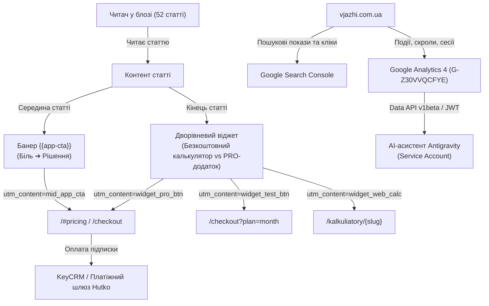

# Налаштування системи аналітики Google Analytics 4, Search Console та наскрізного трекінгу конверсій vjazhi.com.ua

Повний покроковий технічний та стратегічний посібник із налаштування екосистеми аналітики для проєкту vjazhi.com.ua. Документ описує інтеграцію пошукової консолі, розгортання GA4, побудову наскрізної комерційної воронки з блогу в платну підписку та підключення AI-асистента через Google Cloud Service Account для автономного аналізу показників у реальному часі.

### Зв'язок із концепцією
* Базується на: [[Programmatic SEO]]
* Пов'язаний план: [[План впровадження Programmatic SEO vjazhi]]

---

## 1. Загальна архітектура системи збору даних

Екосистема аналітики vjazhi.com.ua побудована за модульним принципом із 4 взаємопов'язаних рівнів:



1. **Google Search Console:** моніторинг видимості в органічному пошуку Google, відстеження запитів (keywords), CTR, середньої позиції та статусу індексації статей і сторінок калькуляторів.
2. **Google Analytics 4 (GA4):** фіксація живих подій відвідувачів на сайті, тривалості взаємодії, глибини скролу та конверсійних шляхів.
3. **Наскрізні UTM-мітки:** точна атрибуція переходів із кожної окремої статті блогу та кожного конкретного блоку (середній банер vs нижній віджет).
4. **Google Cloud Data API:** прямий програмний міст між сховищем аналітики та AI-асистентом для формування автономних звітів без ручного входу в інтерфейси.

---

## 2. Етап 1: Верифікація сайту в Google Search Console (GSC)

### 2.1. Призначення та конфігурація
Для доступу до пошукових даних Google вимагає підтвердження права власності на домен `vjazhi.com.ua`. Найшвидший метод без звернення до DNS-реєстратора — верифікація через **HTML-метатег** у `<head>`.

* **Офіційний верифікаційний токен:** `eVRlAl_Z_sfg0u2ekhg6kfcbsRTqHGiCE0JPmh5kYpU`
* **Файл інтеграції:** `app/layout.tsx`

### 2.2. Код реалізації в Next.js Metadata API
```tsx
export const metadata: Metadata = {
  metadataBase: new URL(siteUrl),
  title: siteTitle,
  description: siteDescription,
  verification: {
    google: 'eVRlAl_Z_sfg0u2ekhg6kfcbsRTqHGiCE0JPmh5kYpU',
    other: {
      'msvalidate.01': '3C24BE13D7527F19D8FA8E15439B41E5', // Bing Webmaster
    },
  },
}
```

> [!IMPORTANT] Важливий нюанс деплою
> Робот перевірки Google Search Console звертається виключно до **публічного сервера в інтернеті** (`https://vjazhi.com.ua`). Локальні зміни на комп'ютері (`localhost`) Google не бачить. Тому обов'язковим кроком перед натисканням кнопки «Підтвердити» є `git push origin main` та завершення автоматичного білду на Vercel (близько 1–2 хвилин).

---

## 3. Етап 2: Розгортання Google Analytics 4 (GA4)

### 3.1. Параметри створеного ресурсу
* **Ресурс:** `vjazhi.com.ua`
* **Ідентифікатор ресурсу (Property ID):** `553209027`
* **Назва веб-потоку:** `ROZRAHUY-I-VYAZHI`
* **URL потоку:** `https://vjazhi.com.ua`
* **Ідентифікатор потоку (Stream ID):** `15741772041`
* **Ідентифікатор вимірювання (Measurement ID):** `G-Z30VVQCFYE`
* **Часовий пояс:** `Europe/Kiev` (UTC+3)
* **Валюта звітності:** `UAH` (Гривня)

### 3.2. Особливість впровадження у Next.js App Router (Чому потрібен прямий тег)
Стандартний компонент Next.js `<Script strategy="afterInteractive">` завантажує скрипти асинхронно через клієнтський бандл після гідратації React. Проте автоматичний сканер перевірки тегу Google (**Google Tag Assistant**) зчитує лише первинний статичний HTML і не виконує важкий JS.

Тому тег GA4 було розміщено **безпосередньо в секції `<head>`** документа у файлі `app/layout.tsx`:

```html
<head>
  <!-- Google tag (gtag.js) -->
  <script
    async
    src="https://www.googletagmanager.com/gtag/js?id=G-Z30VVQCFYE"
  />
  <script
    dangerouslySetInnerHTML={{
      __html: `
        window.dataLayer = window.dataLayer || [];
        function gtag(){dataLayer.push(arguments);}
        gtag('js', new Date());
        gtag('config', 'G-Z30VVQCFYE');
      `,
    }}
  />
  ...
</head>
```

**Результат:** статус у Google Analytics миттєво змінився на:
`✅ На вашем сайте обнаружен тег Google`.

---

## 4. Етап 3: Наскрізне UTM-маркування конверсійної воронки

### 4.1. Бізнес-завдання
Блог містить 52 об'ємні експертні статті (органічний пошуковий трафік). Мета сайту — **продаж платної підписки на мобільний додаток «Розрахуй і В'яжи»** (від 100 грн/міс до 600 грн/рік). Необхідно точно бачити:
1. Яка саме стаття привела читача, що став покупцем?
2. Який саме заклик до дії (CTA) конвертує краще: банер усередині статті чи хаб наприкінці?

### 4.2. Матриця UTM-параметрів
Усі комерційні кнопки отримали стандартизовану розмітку:

| Блок / Елемент | Призначення | Приклад URL із мітками |
|----------------|-------------|-------------------------|
| **Mid-Article Banner** (`{{app-cta}}`) | Заклик після складних розрахунків | `/#pricing?utm_source=blog&utm_medium=article&utm_campaign=A05-rahlan&utm_content=mid_app_cta` |
| **Тест за 100 грн** (у банері) | Швидка пробна покупка | `/checkout?plan=month&utm_source=blog&utm_medium=article&utm_campaign=A05-rahlan&utm_content=mid_test_plan` |
| **PRO-кнопка у віджеті** (Tier 2) | Основна конверсія наприкінці статті | `/#pricing?utm_source=blog&utm_medium=article&utm_campaign=A05-rahlan&utm_content=widget_pro_btn` |
| **Тест за 100 грн** (у віджеті) | Альтернатива річному тарифу | `/checkout?plan=month&utm_source=blog&utm_medium=article&utm_campaign=A05-rahlan&utm_content=widget_test_btn` |
| **Веб-калькулятор** (Tier 1) | Залучення у безкоштовний онлайн-інструмент | `/kalkuliatory/rahlan?utm_source=blog&utm_medium=article&utm_campaign=A05-rahlan&utm_content=widget_web_calc` |

### 4.3. Технічна реалізація віджета
Файли: `lib/blog-app-cta.ts` та `components/blog/blog-calculator-widget.tsx`.
Компонент приймає `articleSlug={post.slug}` і динамічно підставляє назву поточної статті у значення `utm_campaign`.

---

## 5. Етап 4: Інтеграція AI-асистента через Google Cloud API

Щоб AI-асистент мав прямий доступ до аналітики та міг генерувати звіти безпосередньо у робочій сесії, реалізовано інтеграцію через службовий акаунт Google Cloud.

### 5.1. Службовий акаунт (Service Account)
* **Проєкт Google Cloud:** `rozrahuy-i-viazhy`
* **Службовий email:** `vjazhi-google-analytics@rozrahuy-i-viazhy.iam.gserviceaccount.com`
* **Увімкнене API:** `Google Analytics Data API v1beta`
* **Роль у GA4:** «Читач» (Viewer) у Property Access Management.

### 5.2. Автономний клієнт (Node.js без важких залежностей)
Файл: `scratch/ga4_reporter.js`.
Використовує нативну бібліотеку `crypto` для генерації RS256-підписаного JWT, обмінює його на Bearer Access Token у `https://oauth2.googleapis.com/token` та відправляє запити до `https://analyticsdata.googleapis.com/v1beta/properties/553209027:runReport` і `:runRealtimeReport`.

**Результат верифікації API:**
```json
{
  "status": 200,
  "activeUsers": 1,
  "currentPage": "Розрахуй і В'яжи — Ваш помічник для в'язання",
  "currency": "UAH",
  "timeZone": "Europe/Kiev"
}
```

---

## 6. Інструкція: Як переглядати аналітику та видалити старі ресурси

### 6.1. Де дивитися звіти в інтерфейсі GA4
1. **Звіт у реальному часі:**
   * Шлях: **Звіти (Reports)** ➔ **У реальному часі (Realtime)**.
   * Показує активних користувачів за останні 30 хвилин, їхні пристрої, міста та сторінки перегляду.
2. **Аналіз переходів із блогу за UTM-мітками:**
   * Шлях: **Звіти (Reports)** ➔ **Залучення (Acquisition)** ➔ **Залучення трафіку (Traffic acquisition)**.
   * Перемкніть основний параметр на: `Джерело/канал сеансу` (Session source/medium) ➔ побачите рядок `blog / article`.
   * Додайте додатковий параметр (+): `Кампанія сеансу` (Session campaign) ➔ побачите рейтинг статей за кількістю читачів.

### 6.2. Як видалити старі непотрібні ресурси / акаунти
Якщо у списку залишилися застарілі тестові проєкти (`adieusovok`, `mentalne.pro`, `ML`):
1. Перейдіть у **Адміністратор (⚙️ знизу ліворуч)**.
2. У верхньому випадаючому списку оберіть непотрібний акаунт або ресурс.
3. У колонці ресурсу виберіть **«Дані ресурсу» (Property details)**.
4. У правому верхньому кутку натисніть кнопку **«Перемістити в кошик» (Move to Trash)**.
5. Підтвердіть видалення. Ресурс буде остаточно видалено через 35 днів (до цього часу він не відображатиметься в активних звітах).

---

## 7. Чекліст виконаних робіт

* [x] Додано метатег верифікації Google Search Console у `app/layout.tsx`.
* [x] Задеплоєно оновлення на Vercel, перевірено живий код `vjazhi.com.ua`.
* [x] Створено новий ресурс GA4 `vjazhi.com.ua` (`Property ID: 553209027`).
* [x] Отримано лічильник `G-Z30VVQCFYE` та вбудовано безпосередньо в `<head>`.
* [x] Перевірено успішне детектування тегу роботом Google Tag Assistant.
* [x] Створено та збережено ключ Google Cloud Service Account.
* [x] Розроблено автономний скрипт `ga4_reporter.js` для читання звітів через Data API.
* [x] Проведено успішний тест зчитування відвідувача в Realtime-режимі (Status: 200).
* [x] Оновлено комерційну воронку у блозі з наскрізними UTM-мітками.
